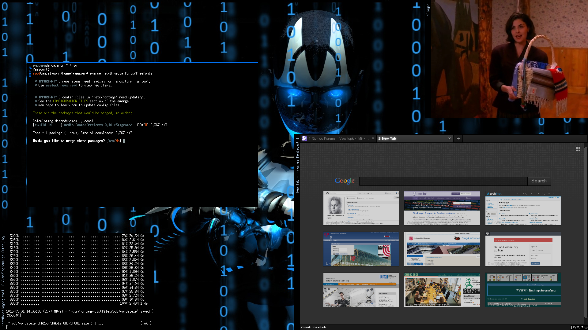

# F(?) Virtual Window Manager

In my youth I was amazed by the [fvwm2](http://fvwm.org/) window managers possiblity 
to fully configure your deskotp and not be limited to what a software developer allows
you to do via configuraion tools; therefore after some fiddling arround with KDE
and Gnome I switched to fvwm. I started working through the man file but as that
is an enormous file I never got far. However I started liking my minimal
desktop setup; my fvwm2rc on which this new setup is based is one of my oldest
configuration files that with some modifications still serves me today, more
than 10 years later.

The advantages of fvwm2 are, that it is one of the most lean window managers (it
comes from the guy that also programmed rxvt - the most lean terminal emulator),
i.e. it does not need much RAM or CPU time and is highly responsive. 

It is
[ICCCM](http://en.wikipedia.org/wiki/Inter-Client_Communication_Conventions_Manual) 
conforming and licensed under the GPL and even today many 
distributions install it as one of the backup window managers. Modern window
managers such as 
[AfterStep](http://afterstep.org/), 
[Xfce](http://www.xfce.org/) or 
[Enlightenment](https://www.enlightenment.org/) are based on fvwm

# Philosophy

I believe a desktop is just a place to put your working things on. As such, it
shouldn't be cluttered - in modern days one also referes to this as "Clean Desk
Policy". As such I do not like to have any icons on the desktop, so I it is
impossible to iconify windows or put directories on the desktop.

There are also no menus or menu bars, as 90% of the time you don't need them, so
they just take up space. Instead everything can be done with simple mouse
buttons.

As most of my work is done in the console anyways, I believe my setup to be
pretty console friendly.

# Navigation

## Screens

The total workspace is devided into 3x3 screens, that behave like a closed
objects, i.e. all sides are "touching". That means when in the upper left corner
screen and moving left, you'll get to the screen of the upper right corner, another
left will bring you to the upper middle screen, and another left bach to the
upper left corner screen.

To navigate to another screen, simply go to the border and move a little bit
harder to that direction (there is a small resistance so that you don't
accidentally always flipp screens).

## Root window

To open new applications and windows, you interact with the root window, i.e.
the desktop directly:

    - Left click: Opens the menu, from which you can launch your applications
    - Middle click: Opens an overview of all windows opened. This is for easy
      window selection - selecting a window will move you to that screen and get
      thta window to the front
    - Right click:  A new urxvt window spawns, i.e. a new console

## Window handling

The focus of a window is gained by moving the mouse into that window. It is not
brought to the front automatically, allowing it to type into a window while
another one is in the front. This way you can have fullscreen windows and
smaller windows in front that bear some information and that you can move
arround while editing in the fullscreen window.

Windows are brought to the front when clicking on the title bar, which is
located on the left hand side of the window.

Using the titlebar one can send the following commands:

    - Leftclick: move it to front
    - Double leftclick: move it to back 
    - Middle click: maximize/normal size it.
    - Right click: destroy the window

It doesn't matter where on the taskbar you perform these actions, the whole
taskbar will listen to this.

One can also resize windows manually by dragging their borders or corners 
(which however are really thin)

# Screenshot

